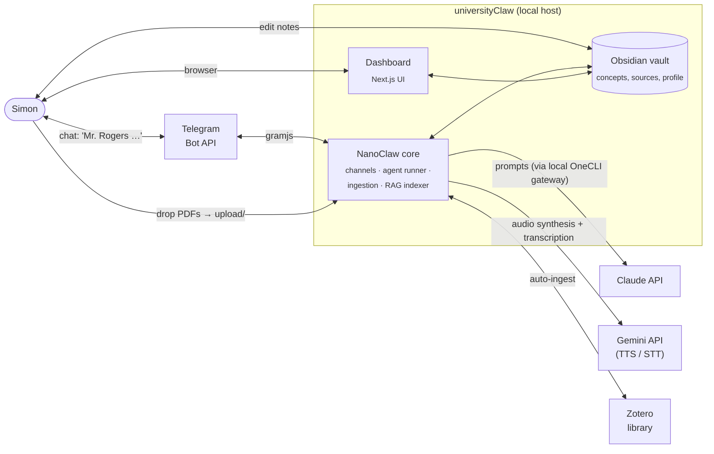
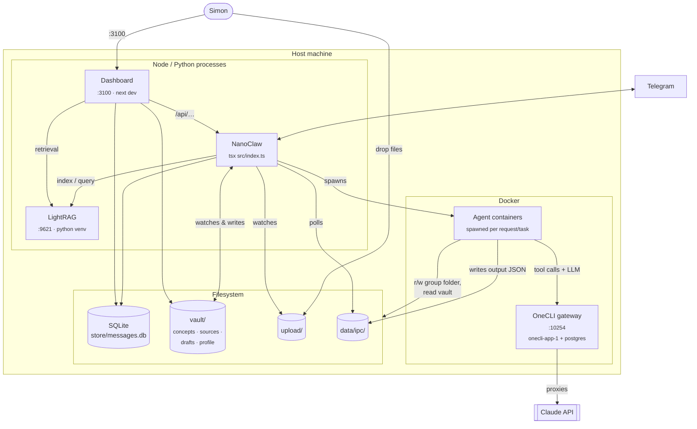
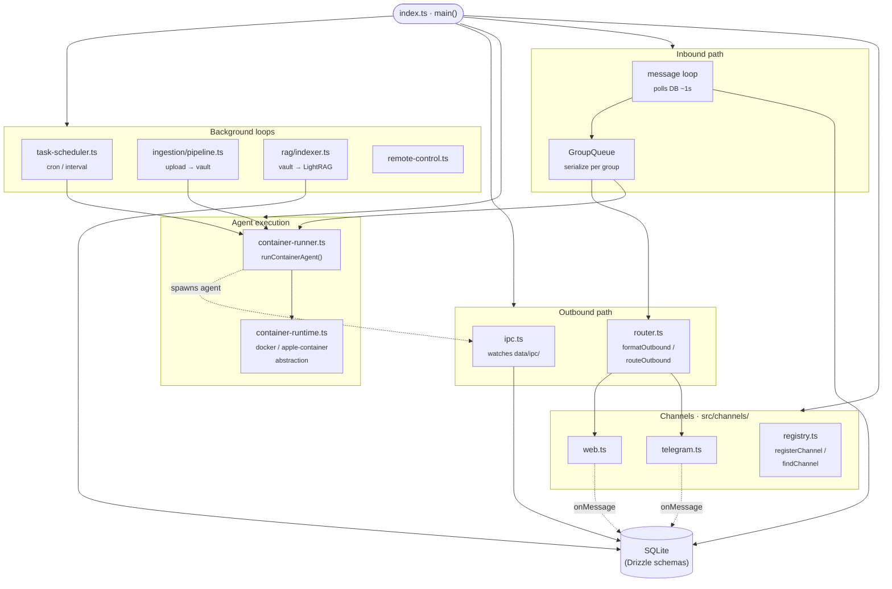
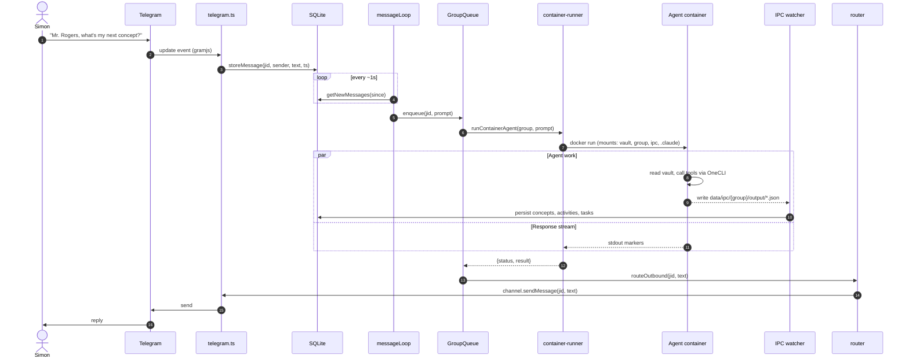
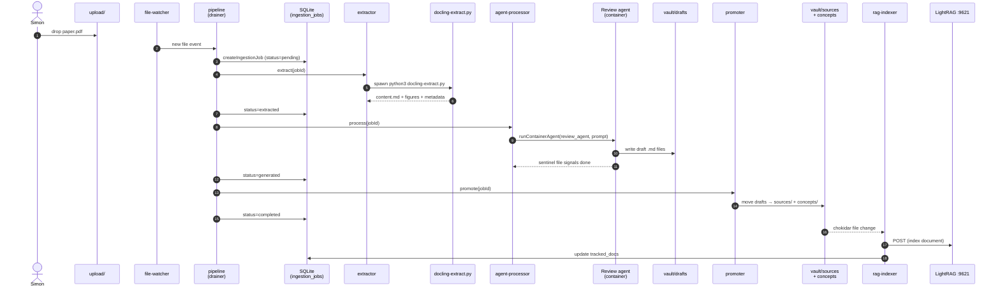

# universityClaw Architecture

Four diagrams, zooming in: **system context → running services → NanoClaw internals → end-to-end flows**.

All diagrams are [Mermaid](https://mermaid.js.org/) and render natively on GitHub. Edit the source below to keep them in sync with the code.

Quick map of where things live:

| Concern | Code |
|---|---|
| Orchestrator + startup | [src/index.ts](../src/index.ts) |
| Channel registry + implementations | [src/channels/](../src/channels/) |
| Outbound formatting + routing | [src/router.ts](../src/router.ts) |
| Agent container spawn | [src/container-runner.ts](../src/container-runner.ts) |
| Host ↔ container IPC | [src/ipc.ts](../src/ipc.ts), `data/ipc/` |
| Cron-style tasks | [src/task-scheduler.ts](../src/task-scheduler.ts) |
| Document ingestion | [src/ingestion/](../src/ingestion/) |
| RAG indexing + client | [src/rag/](../src/rag/) |
| SQLite schema (Drizzle) | [src/db/schema/](../src/db/schema/) |
| Web UI | [dashboard/](../dashboard/) |

---

## 1. System context

Who uses universityClaw, and what external systems does it depend on?

**Notes**

- OneCLI is a **local** credential gateway (`:10254`), not an external service — it proxies to Claude (and others) while keeping secrets off the container.
- Telegram is the only remote channel wired up in `src/channels/` today (`web.ts` is served by the dashboard). WhatsApp/Slack/Discord/Gmail exist as optional skill branches.

---

## 2. Running services

Four long-lived processes run on the host. Each has a different lifecycle and port.

**Lifecycle at a glance**

| Service | How it's started | Port |
|---|---|---|
| OneCLI | `docker restart onecli-app-1 onecli-postgres-1` | 10254 |
| LightRAG | `.venv/bin/python3 -m lightrag.api.lightrag_server …` | 9621 |
| Dashboard | `cd dashboard && npm run dev` | 3100 |
| NanoClaw | `npm run dev` | — |
| Agent containers | spawned by NanoClaw on demand | — (IPC via files) |

See [CLAUDE.md](../CLAUDE.md#start-everything) for the copy-pasteable startup sequence.

---

## 3. NanoClaw internals

Components inside the NanoClaw Node process — what `src/index.ts` boots and how they wire up.

**Key design points**

- **Channel self-registration.** Each channel calls `registerChannel()` at import time; `src/channels/index.ts` is a barrel that triggers those imports.
- **DB is the message bus.** Channels `storeMessage()` on receipt; the message loop polls `getNewMessages()` since `lastTimestamp`. This makes crash recovery trivial — no in-memory queue to lose.
- **GroupQueue serializes per chat.** Two messages in the same group can never run concurrently, so there's no interleaving of responses.
- **IPC is filesystem-based.** Agents write JSON into `data/ipc/{group}/output/`; the host watches the directory, applies each file to the DB, and deletes it. No shared memory, no sockets.

---

## 4. End-to-end flows

### 4a. Chat message → response

### 4b. Document ingestion (`upload/` → vault → RAG)

---

## How to update this doc

- When you add a new **channel**, update §1 (if it's remote) and §3 (channels subgraph).
- When you add a new **long-running service**, update §2.
- When you change **message flow** or **ingestion stages**, update the matching sequence in §4.
- When a file in the "Quick map" table moves or splits, update the table.

Diagrams should match the code. If you find a drift, fix the diagram in the same PR as the code change.
