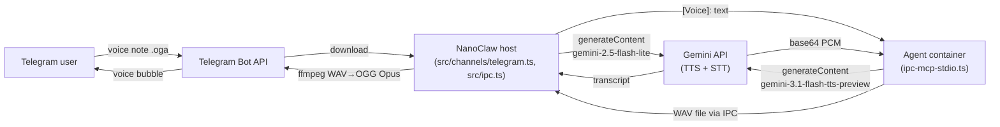

# Gemini TTS/STT Migration — Design

**Status:** Draft
**Date:** 2026-04-18
**Author:** Simon
**Scope:** Replace Mistral with Google Gemini for both speech-to-text (voice note transcription) and text-to-speech (agent voice replies). Hard cutover — no dual-provider setup, no feature flag.

## Goals

- Replace Mistral cloud APIs with Gemini across both audio paths.
- Enable Norwegian TTS (Mistral did not support it; Gemini supports `nb` and `nn`).
- Expose utterance-level style control to the agent via an optional `style_prompt` parameter.
- Preserve the host-side WAV → OGG Opus conversion pipeline untouched. Migration stays localized to the two provider-facing surfaces.
- Standardize the env variable name to `GEMINI_API_KEY`.

## Non-goals

- Live / real-time voice chat (separate project).
- Voice cloning from reference samples.
- Streaming TTS.
- Mid-conversation voice swapping. Voice is hardcoded to a single prebuilt and only swappable via a constant in source.

## Architecture



Two provider-facing surfaces change:

1. **STT — host side**, `src/channels/telegram.ts`. Voice downloads and transcription already happen on the host before the agent is invoked. Only the HTTP call is swapped.
2. **TTS — container side**, `container/agent-runner/src/ipc-mcp-stdio.ts` `synthesize_speech` tool. The tool's output contract (a WAV file path under `/workspace/group/audio/`) is preserved so the downstream IPC and host ffmpeg pipeline do not change.

Everything between the container's WAV file and the outbound voice bubble (IPC JSON, path resolution, ffmpeg invocation, cleanup, `send_voice` tool, Channel interface) is untouched by this migration.

## STT — data flow

```
Telegram voice (.oga)
  → grammY downloads to /tmp/ via @grammyjs/files
  → POST https://generativelanguage.googleapis.com/v1beta/models/gemini-2.5-flash-lite:generateContent
     headers: x-goog-api-key: $GEMINI_API_KEY
     body:
       { contents: [{ parts: [
           { inlineData: { mimeType: "audio/ogg", data: <base64 .oga bytes> } },
           { text: "Generate a transcript of this speech." }
       ]}]}
  → response.candidates[0].content.parts[0].text (trim)
  → delivered to agent as "[Voice]: {text}"
  → temp file unlinked
```

No language hint is sent. Gemini auto-detects Norwegian / English / other from the audio itself. The `[Voice]:` prefix is preserved so the agent knows the input originated from audio.

## TTS — data flow

```
Agent calls synthesize_speech({ text, style_prompt? })
  → container builds prompt text:
       style_prompt ? `${style_prompt}: ${text}` : text
  → POST https://generativelanguage.googleapis.com/v1beta/models/gemini-3.1-flash-tts-preview:generateContent
     headers: x-goog-api-key: $GEMINI_API_KEY
     body:
       { contents: [{ parts: [{ text: prompt }] }],
         generationConfig: {
           responseModalities: ["AUDIO"],
           speechConfig: { voiceConfig: { prebuiltVoiceConfig: { voiceName: "Kore" } } }
         } }
  → response.candidates[0].content.parts[0].inlineData.data
     (base64 raw PCM, 24kHz mono 16-bit little-endian — NOT a WAV)
  → decode to Buffer, prepend 44-byte RIFF/WAVE header
  → write to /workspace/group/audio/tts-{timestamp}-{rand}.wav
  → return { path, duration_seconds }
Agent then calls send_voice(path)
  → unchanged IPC flow → host ffmpeg WAV→OGG Opus → Telegram voice bubble
```

### WAV header format

44-byte standard RIFF/WAVE header. Fields:

| Offset | Bytes | Value |
|---|---|---|
| 0 | 4 | `"RIFF"` |
| 4 | 4 | fileSize - 8 (little-endian u32) |
| 8 | 4 | `"WAVE"` |
| 12 | 4 | `"fmt "` |
| 16 | 4 | 16 (PCM chunk size) |
| 20 | 2 | 1 (PCM audio format) |
| 22 | 2 | 1 (mono) |
| 24 | 4 | 24000 (sample rate) |
| 28 | 4 | 48000 (byte rate = 24000 × 1 × 2) |
| 32 | 2 | 2 (block align) |
| 34 | 2 | 16 (bits per sample) |
| 36 | 4 | `"data"` |
| 40 | 4 | pcmByteLength |

The existing duration estimate formula (`(fileSize - 44) / 48000`) remains correct because byte rate is also 48000 bytes/sec.

## MCP tool contract — `synthesize_speech`

```ts
{
  text: z.string().max(50000).describe(
    'Text to synthesize. You can embed Gemini audio tags like [warmly], ' +
    '[slowly], [whispering], [excitedly] inline to color specific moments ' +
    'within the speech.'
  ),
  style_prompt: z.string().optional().describe(
    'Natural-language utterance-level style directive, e.g. "Say warmly ' +
    'and slowly" or "Speak with calm encouragement". Prepended to the text ' +
    'before synthesis. Use style_prompt for whole-utterance tone; use ' +
    '[inline tags] inside text for moment-specific expression.'
  ),
}
```

Returned JSON is unchanged: `{ path, duration_seconds }`.

`send_voice` is unchanged. `TTS_MAX_TEXT_LENGTH` stays at 50000. The voice is hardcoded to a module-level constant:

```ts
// Voice is a single prebuilt. To try another, change this constant.
// Kore is a balanced multilingual default. Other good starting points:
// "Charon", "Puck", "Zephyr", "Aoede". Full list: 30 prebuilts in Gemini TTS docs.
const GEMINI_TTS_VOICE = "Kore";
const GEMINI_TTS_MODEL = "gemini-3.1-flash-tts-preview";
const GEMINI_TTS_URL = `https://generativelanguage.googleapis.com/v1beta/models/${GEMINI_TTS_MODEL}:generateContent`;
```

## Env & config

### `.env` (user runs manually, not checked in)

```diff
- MISTRAL_API_KEY=...
- google_api_key=...
+ GEMINI_API_KEY=...
```

### `.env.example`

Replace the `# --- Mistral API (TTS + STT) ---` block with:

```
# --- Gemini API (TTS + STT) ---
GEMINI_API_KEY=
```

### `src/container-runner.ts`

Replace the Mistral key injection (lines 251-257) with:

```ts
const geminiKey =
  process.env.GEMINI_API_KEY ||
  readEnvFile(['GEMINI_API_KEY']).GEMINI_API_KEY;
if (geminiKey) {
  args.push('-e', `GEMINI_API_KEY=${geminiKey}`);
}
```

### `src/channels/telegram.ts`

- Constructor param `mistralApiKey` → `geminiApiKey`.
- Private field `mistralApiKey` → `geminiApiKey`.
- `registerChannel` reads `GEMINI_API_KEY` instead of `MISTRAL_API_KEY`.
- Warning message: `"Telegram: GEMINI_API_KEY not set — voice transcription disabled"`.
- Voice handler: swap the Mistral multipart `FormData` POST for the Gemini inline-base64 JSON POST described in the STT data flow. The `.oga` bytes are base64-encoded and sent as `inlineData` with `mimeType: "audio/ogg"`.

### `container/agent-runner/src/ipc-mcp-stdio.ts`

- Delete `MISTRAL_TTS_URL` and `MISTRAL_DEFAULT_VOICE_ID`.
- Add `GEMINI_TTS_URL`, `GEMINI_TTS_MODEL`, `GEMINI_TTS_VOICE` constants.
- `process.env.MISTRAL_API_KEY` → `process.env.GEMINI_API_KEY`.
- Rewrite the `synthesize_speech` body to match the TTS data flow and tool contract above.
- Add a small pure function `pcmToWav(pcm: Buffer): Buffer` that prepends the 44-byte header. Unit-testable in isolation.

## Error handling

Same categories and fallback behavior as the current Mistral integration — no new failure modes are introduced.

| Condition | Behavior |
|---|---|
| `GEMINI_API_KEY` missing (STT) | Log warning, skip transcription, agent receives `[Voice message (transcription failed)]` |
| `GEMINI_API_KEY` missing (TTS) | MCP tool returns error with `isError: true`; agent falls back to text |
| Gemini STT non-2xx / timeout (60s) | Log error with status + body, agent receives `[Voice message (transcription failed)]` |
| Gemini TTS non-2xx / timeout (300s) | MCP tool returns error with body; agent falls back to text |
| TTS response missing `candidates[0].content.parts[0].inlineData.data` | MCP tool returns error (analog of the current `audio_data` missing check) |
| Empty / oversized text | Rejected in-tool before API call (unchanged) |
| ffmpeg / IPC path validation | Unchanged — WAV output preserves the current invariant |

Timeouts: STT `60_000`, TTS `300_000`. Unchanged from the current Mistral integration.

## Docs to update (this migration)

| File | Change |
|---|---|
| `docs/speech.md` | Full rewrite. Replace provider name, endpoints, flow diagrams. Remove "No Norwegian TTS" limitation. Update cost table with Gemini rates. Keep the "Why STT on host" rationale (still applies). Drop the "Why a cloud API for TTS" rationale (obsolete history). |
| `docs/ARCHITECTURE.md` | Mermaid: `mistral["Mistral API<br/>(TTS / STT)"]` → `gemini["Gemini API<br/>(TTS / STT)"]`. Edge label `"audio synthesis"` → `"audio synthesis + transcription"`. |
| `CLAUDE.md` | Env var table row (line 175): `MISTRAL_API_KEY` → `GEMINI_API_KEY`, purpose updated. |
| `.env.example` | Provider block swap. |

## Docs left alone

Historical specs and plans are not rewritten. Active-reference docs above are the only ones updated.

- `docs/superpowers/specs/2026-04-12-multi-method-study-system-design.md` — historical design, leave as-is.
- `docs/superpowers/plans/2026-04-13-study-system-master-plan.md` — historical plan, leave as-is.
- `docs/superpowers/plans/2026-04-16-s8b-audio-scaffolding.md` — historical plan, leave as-is.

## Testing

No existing Vitest coverage of the Mistral paths to port. Strategy: unit-test the deterministic pieces, manual smoke-test the end-to-end audio.

### Unit tests (new)

- `container/agent-runner/src/pcm-to-wav.test.ts` — verify `pcmToWav` produces a valid 44-byte RIFF/WAVE header for a PCM buffer of known length. Golden byte-level comparison of the header region and length bookkeeping.
- `container/agent-runner/src/gemini-tts-request.test.ts` — unit-test the request-body builder (or, if inlined, the `JSON.stringify`'d body shape): with/without `style_prompt`, verify prompt composition and `speechConfig` structure.

### Manual smoke tests (checklist, run before merging)

1. Send a short English voice note to Telegram → agent receives `[Voice]: ...` with correct transcript.
2. Send a Norwegian voice note → transcript is Norwegian.
3. Ask agent to speak → receive a Telegram voice bubble that plays, has a waveform, and sounds like the Kore voice.
4. Ask agent to speak Norwegian → plays Norwegian audio.
5. Ask agent to speak using `style_prompt: "Say warmly and slowly"` → tone is noticeably warmer and slower.
6. Ask agent to speak with inline `[whispering]` / `[slowly]` tags → tags honored at the tagged position.
7. With `GEMINI_API_KEY` unset — send a voice note → agent receives `[Voice message (transcription failed)]`. Ask agent to speak → agent replies in text with a sensible fallback.

### Pre-merge gate

- `npm run build` clean.
- `npm test` green.
- `./container/build.sh` succeeds (builder cache may need pruning per `CLAUDE.md`).

## Rollout

1. Merge on `feat/gemini-tts-stt-migration` via PR to `SimonKvalheim/universityClaw`.
2. User updates local `.env` (rename `google_api_key` → `GEMINI_API_KEY`, delete `MISTRAL_API_KEY`) before pulling.
3. Rebuild container: `./container/build.sh`.
4. Restart NanoClaw.
5. Run the manual smoke checklist.

No migration is needed for stored data — audio files are per-session and ephemeral.

## Open questions

None — all six open decisions resolved during brainstorming.
