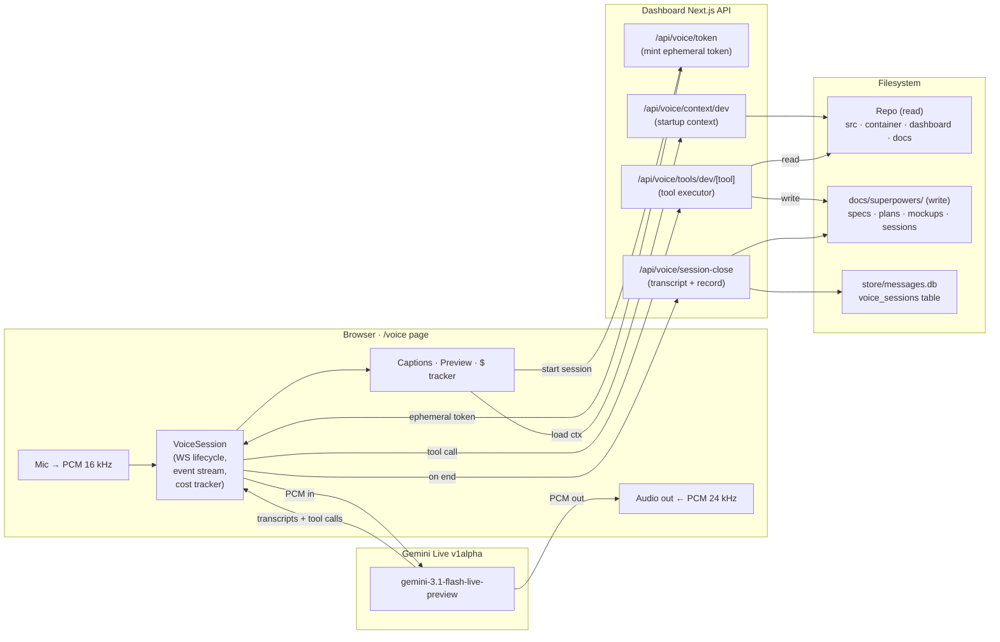

# Live Voice Chat (v1) — Design Spec

## Overview

A new dashboard surface at `/voice` that enables real-time spoken conversation with a **Dev Assistant** persona — a brainstorming and spec-writing partner for uniClaw feature work. The session is native-audio end-to-end: Gemini 3.1 Flash Live hears the developer's voice, reasons, speaks back, and calls read/write tools on the codebase and docs directory.

This v1 intentionally delivers the **voice infrastructure** and the **Dev Assistant persona** together. Mr. Rogers Live (the teaching-assistant persona that routes reasoning through the existing Claude container) is a separate, deferred design — see `2026-04-18-mr-rogers-live-design.md`. The Dev Assistant exercises the full Gemini Live stack without the hybrid-transport complexity, making it the safer first persona to ship and dogfood.

This feature is distinct from the existing async voice-note flow on Telegram, which is being migrated from Mistral to Gemini in a parallel spec (`2026-04-18-gemini-tts-stt-migration-design.md`). Both specs share a single `GEMINI_API_KEY` env var; otherwise they do not overlap.

## Goals

- **Zero to talking in under 5 seconds.** Click mic → Gemini is listening.
- **Gemini has enough project context from the first second** to talk about uniClaw specifically (subsystems, file layout, recent work) without reactive grepping.
- **Captions always visible.** Live transcription of both sides.
- **Preview pane.** Mockups and diagrams render as they are written.
- **Dollar tracker.** You see how much each session costs, in real time and cumulatively.
- **Durable artifacts.** Every session leaves transcripts, specs, plans, mockups, and diagrams on disk.
- **Future-friendly boundaries.** Adding session resumption, Mr. Rogers Live, a phone delivery path, or more personas later is additive, not a rewrite.

## Non-Goals (v1)

- **Mr. Rogers Live persona.** Deferred to its own spec; hybrid transport (Gemini Live ↔ Claude container) is a non-trivial new IPC primitive.
- **Subagent spawning** (e.g. "Gemini, research X in the background"). Discussed and deferred — rich tool surface + project context do the equivalent work more cheaply. If we add it later, the clean shape is an async task queue (research file dropped into `docs/superpowers/research/pending/`, picked up by a background worker, result written to `.../completed/`), not an in-session subagent call.
- **Session resumption** beyond the 15-minute Live API cap. Sessions end; you start a fresh one. The `VoiceSession` abstraction reserves the slot for adding resumption without breaking the UI contract.
- **Phone / Twilio / mobile apps.** Dashboard only.
- **Multi-user.** Single-user, localhost.
- **Voice cloning or custom voices.** Prebuilt Gemini voices only.
- **Tool-use approval UI.** Mockups and specs are cheap to revert via git; an approval step adds friction without proportionate safety gain.
- **Barge-in tuning.** Use Gemini's default VAD.
- **Hard dollar cap per session.** v1 uses a 10-minute soft session limit and visible cost tracker; the user can stop early. If dogfood shows runaway costs, add a cap in v2.

## Route & File Structure

```
dashboard/src/app/voice/page.tsx                           — The page
dashboard/src/app/voice/voice-session.ts                   — VoiceSession class: WS lifecycle, audio I/O, event stream
dashboard/src/app/voice/audio-io.ts                        — Mic capture (AudioWorklet) + playback helpers
dashboard/src/app/voice/cost-tracker.ts                    — Token accumulator + dollar conversion
dashboard/src/app/voice/preview-pane.tsx                   — Mockup iframe / mermaid renderer / history
dashboard/src/app/voice/captions.tsx                       — Scrolling transcript view
dashboard/src/app/voice/personas.ts                        — Persona config (v1: dev)
dashboard/src/app/voice/rates.ts                           — Gemini pricing config (per-1M tokens, by modality)
dashboard/src/app/voice/tests/voice-session.test.ts        — Unit tests against a fake WS server
dashboard/src/app/voice/tests/fake-gemini-server.ts        — Minimal WS fixture for tests
dashboard/src/app/api/voice/token/route.ts                 — Mints ephemeral token for Live API
dashboard/src/app/api/voice/context/dev/route.ts           — Dev Assistant startup context
dashboard/src/app/api/voice/tools/dev/[tool]/route.ts      — Executes a Dev tool call
dashboard/src/app/api/voice/session-close/route.ts         — Persists transcript + session record
docs/superpowers/mockups/YYYY-MM-DD-<slug>.html            — Dev-written HTML+Tailwind mockups (new dir)
docs/superpowers/mockups/YYYY-MM-DD-<slug>.md              — Dev-written mermaid diagrams (same dir)
docs/superpowers/brainstorm-sessions/YYYY-MM-DD-HHMM.md    — Dev session transcripts (new dir)
docs/superpowers/research/                                 — Reserved dir for future subagent results (empty in v1)
```

Schema change: a new `voice_sessions` table in `store/messages.db` (see Cost Tracking).

## Dependencies

- `@google/genai` — TypeScript SDK. Used server-side for ephemeral-token minting; browser uses the SDK's WebSocket client.
- `mermaid` — client-side diagram rendering in the preview pane.
- No new backend services.
- `GEMINI_API_KEY` env var. Current lowercase `google_api_key` is standardized to `GEMINI_API_KEY` in the parallel migration spec; this feature requires that rename to be done (or reads both, with the uppercase taking precedence).

## Architecture



## Data Flow

### Session start

1. User opens `/voice`, clicks **Start**.
2. Frontend calls `POST /api/voice/token`. Optional `resumeHandle` accepted but ignored in v1.
3. Backend uses `GEMINI_API_KEY` and `@google/genai` to mint an ephemeral token bound to `gemini-3.1-flash-live-preview`. Returns `{ token, expiresAt }`.
4. Frontend calls `GET /api/voice/context/dev` for startup context (see Persona).
5. `VoiceSession` opens a WebSocket to Gemini at the `v1alpha` endpoint using the token. Session config:
   - Model: `gemini-3.1-flash-live-preview`
   - Response modalities: `["AUDIO"]`
   - System instruction: Dev Assistant persona prompt
   - Tools: Dev Assistant tool declarations
   - `inputAudioTranscription: {}` and `outputAudioTranscription: {}`
   - Voice: `Zephyr`
6. Immediately after connecting, `VoiceSession` sends a `clientContent` turn with the startup context, then unmutes the mic.

### Talking

1. `audio-io.ts` uses a `MediaStream` → `AudioWorklet` pipeline to resample mic input to **16-bit PCM, 16 kHz, little-endian, mono**, emitting ~20 ms frames.
2. `VoiceSession.sendRealtimeInput({ audio: { mimeType: 'audio/pcm;rate=16000', data: base64Chunk } })` streams frames.
3. Gemini returns `serverContent` events carrying 24 kHz PCM audio + transcription deltas + (optionally) tool calls.
4. An `AudioWorklet`-based playback path buffers and plays incoming PCM.
5. `cost-tracker.ts` listens for `usageMetadata` on each server turn, multiplies by rates from `rates.ts`, exposes a live dollar figure to the UI.
6. Transcription events update the captions component.
7. When Gemini emits a `toolCall`, `VoiceSession` `POST`s to `/api/voice/tools/dev/[tool]` with the args. The backend executes, returns JSON. `VoiceSession` replies to Gemini with `toolResponse`.
8. Mockup/diagram tool calls return `{ path, previewUrl }`; the preview pane reloads to show the file.

### Session end

Triggered by: user **Stop**, tab close, 10-minute soft cap (with warnings), 15-minute Gemini hard cap, or WebSocket disconnect.

1. `VoiceSession` emits `onSessionEnd({ transcript, startedAt, endedAt, usage, resumeHandle? })`.
2. Frontend `POST /api/voice/session-close` with the payload. Uses `fetch(..., { keepalive: true })`; `navigator.sendBeacon` is only a fallback (its ~64 KB body cap will truncate long transcripts).
3. Server persists: verbatim transcript to `docs/superpowers/brainstorm-sessions/YYYY-MM-DD-HHMM.md` (with frontmatter cross-referencing any files written); a session record to `voice_sessions` table (see Cost Tracking).
4. No summarization step. Raw brainstorms are more valuable than summaries for dev work.

## Persona: Dev Assistant

**Backend**: Gemini direct. No Claude container in the loop.

**Default voice**: `Zephyr` (clear, neutral).

### System prompt (sketch — final wording during implementation)

> You are the uniClaw Dev Assistant — a design and brainstorming partner speaking with the developer by voice. uniClaw is their personal Claude assistant / teaching platform, forked from NanoClaw.
>
> You have read-only access to the codebase and docs, plus write access to `docs/superpowers/specs/`, `docs/superpowers/plans/`, and `docs/superpowers/mockups/`. You do NOT edit source code, configs, or tests — Claude Code handles implementation; your job is to help the developer think, then capture the result as a written artifact.
>
> Use the context block below. It contains the project's CLAUDE.md, architecture overview, a subsystem map, available npm scripts, and current repo state. Use it to speak specifically about their codebase, not generically.
>
> Keep spoken turns short (aim ≤ 15 seconds). Think out loud. Ask about constraints before drafting. When writing specs or plans, match the structure of existing files in those directories. For mockups, produce single-file HTML with Tailwind via CDN. For architecture or flow questions, prefer mermaid diagrams over prose.

### Startup context

Fetched by `GET /api/voice/context/dev`. Composed on the server at request time; delivered as a single `clientContent` turn after WS connect. Components:

1. **`CLAUDE.md`** — full file (~188 lines, ~2 KB).
2. **`docs/ARCHITECTURE.md`** — full file (~302 lines, ~4 KB).
3. **Subsystem map** — generated: top-level dirs under `src/` and `dashboard/src/` with a one-liner each. Derived from a static map in `src/voice-context.ts` (list maintained by hand; cheap to update, avoids runtime guessing).
4. **`package.json` scripts** — names + descriptions, both root and `dashboard/`.
5. **Repo state** — current branch, `git status --short`, last 10 commit subjects, filenames (not contents) in `docs/superpowers/specs/` and `docs/superpowers/plans/`.
6. **Session meta** — timestamp, `voice_session_id` (UUID, used for correlated logging).

Estimated total: 6–9 K tokens. Re-tokenized on each fresh session. At Flash Live rates this is a few cents per start — acceptable given it eliminates most reactive grepping. The plan measures actual size against a real payload and revises the context if it exceeds 12 K tokens.

### Tool surface

| Tool | Args | Returns | Scope |
|---|---|---|---|
| `read_file` | `{ path: string }` | `{ content: string }` | Read; see Read Scope below |
| `glob` | `{ pattern: string }` | `{ paths: string[] }` | Read |
| `grep` | `{ pattern: string, path?: string, glob?: string }` | `{ matches: Array<{path, line, text}> }` | Read |
| `git_log` | `{ limit?: number, path?: string }` | `{ commits: Array<{sha, subject, date, author}> }` | Read |
| `git_status` | `{}` | `{ branch, staged, modified, untracked }` | Read |
| `list_docs` | `{ kind: 'specs' \| 'plans' \| 'mockups' \| 'sessions' }` | `{ files: string[] }` | Read |
| `read_doc` | `{ kind: 'specs' \| 'plans' \| 'mockups' \| 'sessions', name: string }` | `{ content: string }` | Read (convenience over `read_file` for the docs dir) |
| `write_spec` | `{ slug: string, content: string }` | `{ path: string }` | Write to `docs/superpowers/specs/YYYY-MM-DD-<slug>.md` |
| `write_plan` | `{ slug: string, content: string }` | `{ path: string }` | Write to `docs/superpowers/plans/YYYY-MM-DD-<slug>.md` |
| `write_mockup` | `{ slug: string, html: string }` | `{ path: string, previewUrl: string }` | Write to `docs/superpowers/mockups/YYYY-MM-DD-<slug>.html` |
| `write_diagram` | `{ slug: string, mermaid: string, title?: string }` | `{ path: string, previewUrl: string }` | Write to `docs/superpowers/mockups/YYYY-MM-DD-<slug>.md` with a mermaid code block |

### Read scope

Allowed read roots: `src/`, `container/`, `dashboard/src/`, `docs/`, `scripts/`, `public/`, and root config files by explicit name (`package.json`, `tsconfig.json`, `next.config.ts`, `vitest.config.ts`, `eslint.config.mjs`, `postcss.config.mjs`, `README.md`, `CLAUDE.md`, `CONTRIBUTING.md`).

Denied (reject with clear error): `.env*`, `store/`, `onecli/`, `groups/`, `data/`, `node_modules/`, `.venv/`, `dashboard/node_modules/`, `.git/`, anything outside the repo root.

The backend tool handler enforces scope by:

1. Resolving the requested path with `fs.realpath` (follows symlinks, rejects on broken link).
2. Asserting the resolved path has the repo root as a prefix (no escape via symlink).
3. Asserting the resolved path has one of the allowed roots as a prefix AND none of the denied substrings.
4. Returning a size-bounded response: `read_file` truncates at 256 KB with a clear `[truncated at 256 KB — use grep/glob for larger files]` marker appended.

### Write scope and guards

All write tools apply these guards (server-owned, not trusted to the model):

1. **Slug sanitization**: regex `^[a-z0-9-]{1,80}$`. No slashes, no dots, no parent traversal. Reject otherwise.
2. **Date prefix is server-generated**, not passed by Gemini. Format: `YYYY-MM-DD`. The model's `slug` argument never sees the date.
3. **Final path construction**: `path.join(repoRoot, targetDir, today + '-' + slug + '.' + ext)`. After construction, resolve with `fs.realpath` and assert prefix match against `targetDir` (symlink-escape guard).
4. **Content size cap**: 256 KB per write (`content`, `html`, or `mermaid`). Reject oversized with a clear error.
5. **Existing-file behavior**: if the resolved path exists and content differs, return `{ error: "would overwrite <path>", existingContent: "…" }` and refuse. Gemini can choose a different slug. An explicit `replace: true` flag is NOT added in v1.
6. **Iframe sandbox for mockups**: rendered with `<iframe sandbox="allow-scripts" srcDoc={html}>` (no `allow-same-origin`). This intentionally blocks `localStorage`, `fetch` to the origin, and cookie access. The Dev Assistant is told to produce self-contained mockups; document this constraint in the system prompt.

## Preview Pane

A tabbed side panel within `/voice`:

- **Mockup tab** — latest `write_mockup` rendered in a sandboxed `<iframe sandbox="allow-scripts" srcDoc={html}>`. Viewport sized to match a typical dashboard frame (~1280×720); zoom controls optional in v2.
- **Diagram tab** — latest `write_diagram` rendered with client-side `mermaid.js` initialized on mount.
- **History dropdown** — lists every mockup/diagram written during the current session. Swap by selecting.

Files persist on disk at `docs/superpowers/mockups/`; session history is page-scoped and resets on nav. Prior sessions' artifacts are reached by grepping the mockups dir.

## Captions

Scrolling transcript pane beneath the mic controls:

- Input transcription (user) — **left-aligned, muted color**.
- Output transcription (Gemini) — **right-aligned, normal color**, prefixed with the persona name.
- Auto-scroll to bottom on new content; manual scroll-up pins the view until user returns to bottom.
- **Copy session** button copies the full transcript to clipboard.

Captions update in real time as transcription events arrive over the WebSocket.

## Cost Tracking

### Data sources

Gemini Live streams `usageMetadata` with each server turn. Known axes:

- Text tokens in
- Text tokens out
- Audio tokens in
- Audio tokens out
- Tool-call tokens (folded into text if not separately reported)

Pricing lives in `dashboard/src/app/voice/rates.ts` as a hand-maintained config (values pulled from Google's pricing page at implementation time; marked with an `# as of YYYY-MM-DD` comment so staleness is visible). A single source of truth used by both the live ticker and the session-close persistence.

### Live UI

Next to the mic controls in `/voice`:

- **Session cost** (formatted as `$0.0842`, 4 decimal precision) updating every time a new `usageMetadata` event arrives.
- Breakdown tooltip on hover: text in / audio in / text out / audio out (tokens and $).
- **Today** and **This month** rollups pulled from the `voice_sessions` table on page load and incremented live.

### Persistence

New SQLite table:

```sql
CREATE TABLE voice_sessions (
  id TEXT PRIMARY KEY,                 -- voice_session_id (UUID)
  persona TEXT NOT NULL,               -- 'dev' in v1
  started_at TEXT NOT NULL,            -- ISO timestamp
  ended_at TEXT NOT NULL,              -- ISO timestamp
  duration_seconds INTEGER NOT NULL,
  text_tokens_in INTEGER NOT NULL DEFAULT 0,
  text_tokens_out INTEGER NOT NULL DEFAULT 0,
  audio_tokens_in INTEGER NOT NULL DEFAULT 0,
  audio_tokens_out INTEGER NOT NULL DEFAULT 0,
  cost_usd REAL NOT NULL,              -- computed at close using rates.ts
  rates_version TEXT NOT NULL,         -- a hash/version string of rates.ts so old rows are explainable
  transcript_path TEXT,                -- docs/superpowers/brainstorm-sessions/...
  artifacts TEXT                       -- JSON array of files written during session
);
CREATE INDEX idx_voice_sessions_started ON voice_sessions(started_at);
```

### Reporting

- Session-close writes one row.
- Dashboard exposes a simple `/voice/history` view (stretch goal — not required for MVP): list of sessions with cost and artifacts. v1 just shows daily/monthly rollups inline on `/voice`.

### Budget guardrails

- **Today** and **This month** totals are shown; if the month passes a user-configurable threshold (env var `VOICE_MONTHLY_BUDGET_USD`, default unset), a non-blocking banner warns on session start.
- No hard cutoff in v1. A runaway session is bounded by the 10-minute soft limit and the 15-minute Gemini hard cap.

## Session Lifecycle Edge Cases

- **Tab closes mid-session**: `beforeunload` triggers `fetch('/api/voice/session-close', { keepalive: true, body: JSON })`. Falls back to `sendBeacon` only for small payloads (≤ 48 KB). If both fail, transcript is lost; a partial session record is still written (with `transcript_path: null`) so the cost is tracked.
- **WebSocket drops unexpectedly**: UI shows "connection lost — reconnect?" button. No auto-reconnect in v1. Transcript up to the drop is preserved and flushed to disk via `session-close` as if the user stopped.
- **10-minute soft cap approaches**: show countdown at 2:00 remaining; at 0:30, a spoken prompt from Gemini ("we have thirty seconds left in this session") plus visual warning. At 10:00, session ends gracefully.
- **15-minute Gemini hard cap**: Gemini closes the WS. Treated same as a user-triggered end.
- **Tool call fails**: return `{ error: string }`. Gemini decides how to verbalize. Server logs under `voice_session_id`.
- **Tool call times out (10 s)**: return `{ error: "timeout" }`. Server logs. No retry.
- **Write tool conflict** (file exists, differs): return `{ error: "would overwrite <path>", existingContent: "…" }`. Gemini picks a new slug.
- **Startup-context fetch fails**: show a prominent error and block session start. Without context the Dev Assistant provides much less value; better to fail loudly.

## Observability

A single `voice_session_id` (UUID) is generated on session start and propagated through every log line and database row for correlation.

### Logs (structured JSON, written to `data/voice.log`)

- `session.start` — persona, model, context size (bytes, tokens estimate)
- `session.end` — reason (user_stop / tab_close / soft_cap / hard_cap / ws_drop), duration, cost
- `tool.call` — tool name, args (summarized; no file contents), duration
- `tool.error` — tool name, args (summarized), error
- `usage.turn` — incremental token counts (sampled, not every turn — e.g. one log per 30 s)
- `error.*` — any exception thrown in backend handlers

### Metrics (manual for v1, prometheus-friendly names chosen for later)

- `voice_sessions_total{persona, end_reason}`
- `voice_session_duration_seconds` (histogram)
- `voice_session_cost_usd` (histogram)
- `voice_tool_calls_total{tool, outcome}`
- `voice_tool_duration_seconds{tool}` (histogram)

v1 does not export these to a metrics backend; the `voice_sessions` table and the log file carry the data. Adding a Prometheus endpoint is v2 if needed.

## Privacy & Retention

- **Brainstorm transcripts** live at `docs/superpowers/brainstorm-sessions/`. This directory is **outside the RAG indexer's watch scope** (`src/rag/indexer.ts` watches vault only; verify during implementation). They are committed to git along with other spec work; be aware when sharing a repo publicly.
- **`voice_sessions` table** lives in `store/messages.db`. Cost and duration data only — no transcript content duplicated there.
- **No automatic deletion** of transcripts or session records. If you want to redact a session, delete the transcript file and the row manually.
- **Nothing leaves localhost.** Gemini's server-side retention is governed by Google's API terms; no additional copies are stored beyond what's listed here.

## Security

**Current state**: dashboard has no auth. Voice routes inherit that.

**Implications**:

- `/api/voice/token` will mint ephemeral tokens for anyone who can reach `localhost:3100`.
- Tool routes execute real reads and writes to `docs/superpowers/`.

**Enforcement for v1**:

- Dashboard must bind to `127.0.0.1` only. If Next.js is ever started with `-H 0.0.0.0` during development, the voice feature must refuse to serve. Implement a startup check in `token/route.ts` that reads `process.env.HOSTNAME` and the request `Host` header; return 403 if the host is not a loopback address.
- A banner on `/voice` states: "Localhost only — do not expose without auth." The banner includes a link to the deferred dashboard-auth work.
- Write tools already enforce path scoping and symlink escape protection (see Write scope and guards).
- Read tools enforce their allow-list and realpath check.

**Out of scope for v1**: dashboard auth itself; per-tool rate limiting; CSP headers beyond the iframe sandbox attribute.

## Testing

### Unit tests (Vitest)

- Token endpoint response shape (mock `@google/genai`).
- Context endpoint: mock fs + git; assert payload structure and size bounds.
- Each tool handler: fixture repo with both allowed and denied paths; assert success, scope rejection, size cap, symlink escape rejection.
- Path sanitization: slug regex tests (empty, too long, slashes, dots, unicode, parent traversal, trailing whitespace).
- Session-close: assert transcript file, session row, and cost math.
- `cost-tracker.ts`: feed recorded `usageMetadata` sequences, assert totals.

### Integration test via fake WS server

`dashboard/src/app/voice/tests/fake-gemini-server.ts` implements just enough of the Live protocol (config handshake, client/server content frames, tool-call/tool-response, usage metadata) for end-to-end tests. Exercise:

- Connect, send a fake user turn, receive a fake assistant turn, assert captions render.
- Tool call: fake server emits a `tool_call`, session forwards to `/api/voice/tools/dev/*`, session replies with tool response, fake server emits final assistant turn.
- Session end: close from server side, assert `/api/voice/session-close` called with full transcript.
- Cost tracking: fake server emits `usageMetadata`; assert live UI value updates.

Replay-based tests keep the real Gemini off the hook during CI. A manual smoke test against the real service is the only step requiring a key.

### Manual dogfood checklist

A short checklist (committed alongside the spec) that exercises: first start from scratch, second start in same day (rollups work), tab close mid-session, hitting the soft cap, a denied read, a denied write (existing file conflict), a mockup, a diagram.

## Rollout

1. Ship behind a conditional nav link in the dashboard (`NODE_ENV=development`). No public surface.
2. Dogfood for at least one week. Track per-session via the `voice_sessions` table.
3. **Success criteria** for v2 planning (each measured over dogfood window):
   - **Time-to-first-audio** ≤ 5 s in ≥ 95% of starts.
   - **Tool error rate** ≤ 2% of tool calls (excludes user-caused denials).
   - **Zero write-scope escapes** (no file written outside `docs/superpowers/*`).
   - **p50 session cost** ≤ $0.50; **p95** ≤ $1.50. If these blow out, revisit context size and output modality.
   - **Subjective usefulness**: the developer writes ≥ 3 specs/plans/mockups through the Dev Assistant and judges them worth keeping.
4. On the basis of dogfood findings, decide the order of v2 items: Mr. Rogers Live, session resumption, cost caps, `/voice/history` page, subagent research queue.

## Environment

- `GEMINI_API_KEY` — required. Set by the migration spec; this feature fails loudly if absent.
- `VOICE_MONTHLY_BUDGET_USD` — optional; when set, the monthly rollup shows a warning banner above this threshold.
- No container-side env changes.

## Error Handling (summary)

| Scenario | Behavior |
|---|---|
| Missing `GEMINI_API_KEY` | `/api/voice/token` returns 500 with a clear message; UI shows setup hint. |
| Token mint failure (network, quota) | Surface Google's error verbatim; do not retry silently. |
| Mic permission denied | Inline instructions to enable; no session starts. |
| Audio worklet fails to load | Fall back to `AudioBufferSourceNode`-based playback (degraded but functional). Log. |
| Unknown tool | Server returns `{ error: "unknown tool" }`; Gemini apologizes verbally. Log. |
| Denied read/write path | Server returns `{ error: "path out of scope: <path>" }`. Log. Gemini adjusts. |
| Write file exists with diff content | Return `{ error: "would overwrite <path>" }`. Gemini picks new slug. |
| Tab close mid-session | `fetch({ keepalive: true })` flushes transcript + record. Best effort. |

## Open Questions (decided — no plan deferrals)

The previous draft left several items as plan-deferred; they're resolved here so the plan is not blocked:

- **Voice selection**: Hardcoded `Zephyr` in `personas.ts`. Reviewer can edit the file to try alternatives. Not exposed in UI.
- **Context injection mechanism**: First `clientContent` turn after WS connect. Not part of system instruction (keeps it refreshable if we ever want to send updates mid-session).
- **Audio worklet processor**: Custom-written 16 kHz resampler in v1 (<100 lines, no native dependency). Small enough to review and audit.
- **Mockup iframe sandbox flags**: `allow-scripts` only (no `allow-same-origin`). Documented to the Dev Assistant via system prompt.

## Future Work (out of scope)

- **Mr. Rogers Live** (separate spec).
- **Session resumption** — reconnect with a handle across multiple 15-min windows.
- **Subagent research queue** — async task queue under `docs/superpowers/research/{pending,completed}/`.
- **`/voice/history` page** — per-session cost, transcript, artifacts list.
- **More personas** — e.g. a "Read-aloud" persona for listening to specs.
- **Phone delivery** — Twilio bridge reusing the backend tool surface.
- **Dashboard auth** — required before any network exposure.
- **Prometheus metrics exporter** — currently `voice_sessions` table + logs.
- **Tool approval UI** — only relevant if Dev Assistant later gains write access outside `docs/superpowers/`.
- **VAD sensitivity controls** — expose Gemini's tuning knobs.

## Relationship to Other Specs

- `2026-04-18-gemini-tts-stt-migration-design.md` — parallel work renaming `google_api_key` → `GEMINI_API_KEY` and removing Mistral from the async voice-note flow. This feature requires the rename.
- `2026-04-18-mr-rogers-live-design.md` (deferred stub) — the teaching-assistant voice persona; hybrid Gemini Live ↔ Claude container architecture. Blocked on designing a request/response IPC primitive.
